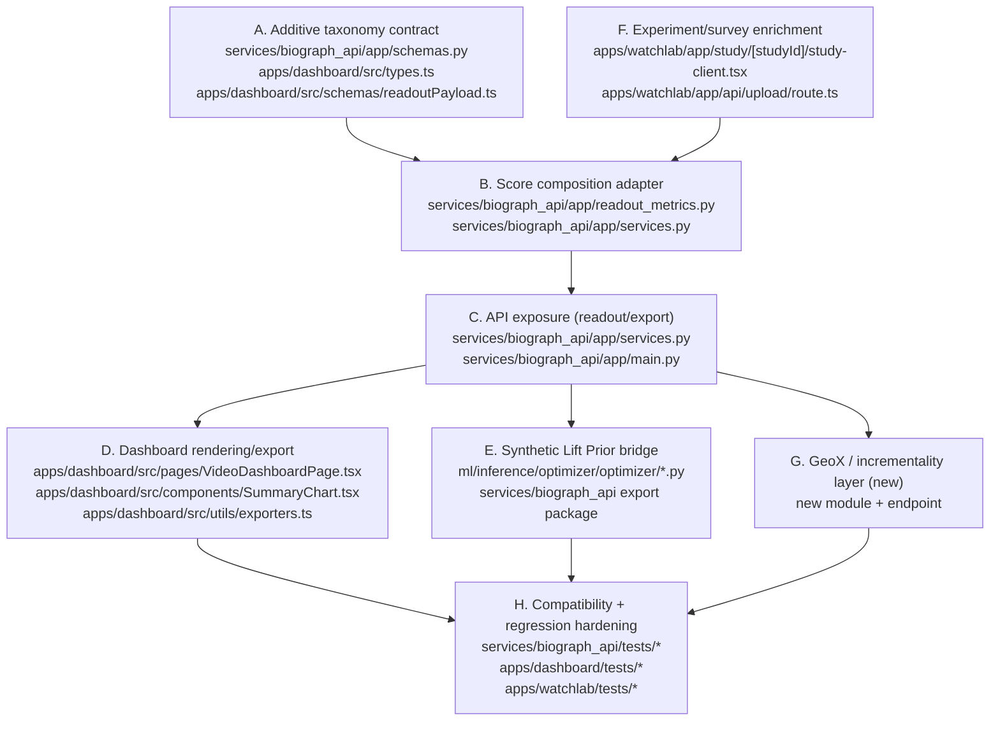

# AlphaEngine Neuroscience Scoring Gap Report

Date: 2026-03-07
Repository: `/Users/johnkim/Documents/neurotrace`

## Scope
This report inspects the current repository implementation and maps concrete gaps for a new neuroscience-driven scoring system without changing runtime behavior.

## 1) Current Architecture Inventory

### 1.1 Stack and runtime boundaries

| Layer | Runtime | Primary paths | Boundary and responsibility |
|---|---|---|---|
| Study capture app | Next.js 15 + React 19 + TypeScript | `apps/watchlab/app/study/[studyId]/study-client.tsx`, `apps/watchlab/app/api/upload/route.ts` | Consent-first session flow, telemetry/annotations/survey capture, upload forwarding to API |
| API + scoring | FastAPI + SQLAlchemy + Pydantic | `services/biograph_api/app/main.py`, `services/biograph_api/app/services.py`, `services/biograph_api/app/readout_metrics.py` | Ingest + canonical alignment + readout/scoring + prediction + export |
| Biometrics extraction worker | Python CLI package (MediaPipe/OpenCV) | `services/extractor_worker/biotrace_extractor/extractor.py` | Frame-level AU/blink/gaze/quality proxy extraction |
| Dashboard | Vite + React + MUI + TypeScript | `apps/dashboard/src/pages/VideoDashboardPage.tsx`, `apps/dashboard/src/components/SummaryChart.tsx` | Readout visualization, diagnostics, export package download |
| ML training/inference | Python (`ml_pipeline`) + XGBoost | `ml/training/ml_pipeline/*.py` | Dataset export, model train/infer for `reward_proxy` + aliases |
| Edit optimizer | Python rules engine | `ml/inference/optimizer/optimizer/engine.py` | Heuristic uplift suggestions and predicted delta engagement |
| Shared contracts | Zod + Pydantic | `packages/common/zod/sessionBundle.ts`, `packages/common/pydantic/session_bundle.py` | Cross-language upload contract parity |

### 1.2 Package layout
- `apps/watchlab`: participant study app and upload API.
- `services/biograph_api`: ingestion, readout, prediction, queue.
- `services/extractor_worker`: passive signal extractor package.
- `apps/dashboard`: analyst dashboard and readout export UX.
- `ml/training`: feature extraction, dataset export, training, inference utilities.
- `ml/inference/optimizer`: rule-based uplift suggestion engine.
- `packages/common`: shared schema contract.
- `infra/docker-compose.yml`: local runtime orchestration.

### 1.3 Data stores
- Primary relational store: Postgres (`infra/docker-compose.yml`, service `db`).
- ORM models: `services/biograph_api/app/models.py`.
- Migration history: `services/biograph_api/alembic/versions/*.py`.
- Key persisted entities:
  - study/video/session graph (`Study`, `Video`, `Session`, `Participant`)
  - trace and labels (`TracePoint`, `SessionAnnotation`, `SurveyResponse`, `SessionPlaybackEvent`)
  - scene graph (`VideoScene`, `VideoCut`, `VideoCtaMarker`)
- Artifact files:
  - model artifact path from `Settings.model_artifact_path` in `services/biograph_api/app/config.py`
  - MLflow local URI default in `ml/training/ml_pipeline/config.py` (`file:./mlruns`)

### 1.4 Queues/jobs
- In-product queue-like component (on-demand API):
  - `GET /testing-queue` (`services/biograph_api/app/main.py:get_testing_queue`)
  - construction logic: `services/biograph_api/app/active_learning.py:build_testing_queue`
- No persistent brokered queue (no Celery/RQ/Bull/SQS/Kafka integration found).
- CI jobs:
  - `.github/workflows/readout-guardian-check.yml`
  - `.github/workflows/readout-guardian-baseline-update.yml`

### 1.5 Model-serving components
- Online prediction endpoint: `POST /predict` in `services/biograph_api/app/main.py:predict_traces`.
- Service bridge: `services/biograph_api/app/predict_service.py:predict_from_video`.
- Fallback deterministic heuristic predictions if model/artifact unavailable.
- Training/inference implementation:
  - `ml/training/ml_pipeline/model.py` (multi-target regressors)
  - `ml/training/ml_pipeline/infer.py` (prediction + uncertainty)

### 1.6 API surface (current)
From `services/biograph_api/app/main.py`:
- `POST /studies`
- `POST /videos`
- `GET /videos`
- `GET /videos/{id}/scene-graph`
- `GET /videos/{id}/cta-markers`
- `PUT /videos/{id}/cta-markers`
- `POST /sessions`
- `POST /sessions/{id}/trace`
- `POST /sessions/{id}/survey`
- `POST /sessions/{id}/annotations`
- `POST /sessions/{id}/telemetry`
- `GET /videos/{id}/summary`
- `GET /videos/{video_id}/readout`
- `GET /videos/{video_id}/readout/export-package`
- `POST /predict`
- `GET /testing-queue`

### 1.7 Frontend/dashboard layers
- Route shell: `apps/dashboard/src/App.tsx`.
- Pages:
  - `apps/dashboard/src/pages/HomePage.tsx`
  - `apps/dashboard/src/pages/VideoDashboardPage.tsx`
  - `apps/dashboard/src/pages/PredictorPage.tsx`
- Readout mapping/export:
  - `apps/dashboard/src/utils/readout.ts`
  - `apps/dashboard/src/utils/exporters.ts`
- Chart layer:
  - `apps/dashboard/src/components/SummaryChart.tsx`

## 2) Current Logic Ownership (Where Things Live)

### Emotion/attention/biometrics/scoring
- Passive biometrics extraction:
  - `services/extractor_worker/biotrace_extractor/extractor.py:SessionExtractor.extract`
  - AU proxies: `services/extractor_worker/biotrace_extractor/au_proxy.py:estimate_au_proxies`
  - Blink and inhibition: `blink.py`, `rolling.py`
  - Quality/tracking/gaze proxies: `quality.py`
- Readout metric formulas:
  - `services/biograph_api/app/readout_metrics.py`
  - key symbols: `compute_attention_score`, `compute_attention_velocity`, `compute_reward_proxy_decomposition`, `build_scene_diagnostic_cards`
- Readout assembly and aggregation:
  - `services/biograph_api/app/services.py:build_video_readout`
  - computes traces, segments, diagnostics, aggregate synchrony (`attention_synchrony`, `blink_synchrony`, `grip_control_score`)

### Prediction logic
- API entry: `services/biograph_api/app/main.py:predict_traces`
- Runtime inference bridge: `services/biograph_api/app/predict_service.py`
- Core model inference: `ml/training/ml_pipeline/infer.py`
- Feature extraction for prediction: `ml/training/ml_pipeline/feature_extraction.py`

### Upload and experiment logic
- Study flow and experimental stages:
  - `apps/watchlab/app/study/[studyId]/study-client.tsx`
  - stages: onboarding -> camera -> watch -> annotation -> survey
- Upload forwarding and fallback handling:
  - `apps/watchlab/app/api/upload/route.ts`
  - fallback trace source logic: `apps/watchlab/lib/traceRows.ts`
  - synthetic trace builder: `apps/watchlab/lib/helloTrace.ts`
- Study config endpoint:
  - `apps/watchlab/app/api/study/[studyId]/config/route.ts`

### Reporting logic
- API-level report payloads:
  - summary: `services/biograph_api/app/services.py:build_video_summary`
  - readout: `services/biograph_api/app/services.py:build_video_readout`
  - export package: `services/biograph_api/app/services.py:build_video_readout_export_package`
- Dashboard export builders:
  - `apps/dashboard/src/utils/exporters.ts`

## 3) Mapping to Target Score Taxonomy

| Target score | Current implementation anchor | Status now | Gap summary |
|---|---|---|---|
| Arrest Score | `attention_score`, opening diagnostics `hook_strength` (`readout_metrics.py`, `build_scene_diagnostic_cards`) | Partial | No explicit canonical Arrest Score field; currently derived implicitly from attention/reward windows |
| Attentional Synchrony Index | `ReadoutAggregateMetrics.attention_synchrony` (`schemas.py`, `services.py`) | Present (near-ready) | Naming and productization only; no taxonomy-specific field alias/object |
| Narrative Control Score | `grip_control_score` (aggregate mean of synchrony components in `services.py`) | Partial | No narrative-specific decomposition or standalone score semantics |
| Blink Transport Score | `blink_inhibition`, `blink_rate`, `rolling_blink_rate` (`readout_metrics.py`, extractor `rolling.py`) | Partial | Signal primitives exist; explicit normalized score not exposed |
| Boundary Encoding Score | scene/cut/cta transition handling (`_resolve_scene_alignment`, `scene_change_signal` in `services.py`) + optimizer cut realignment (`ml/inference/optimizer/optimizer/engine.py`) | Partial | No top-level Boundary Encoding score trace/summary field |
| Reward Anticipation Index | `reward_proxy` (readout + prediction + dataset target) | Partial (semantic fit) | Canonical field exists but taxonomy label/object alias not exposed yet |
| Social Transmission Score | aggregate synchrony + cohort traces only | Missing | No social propagation features/signals or score in backend schemas |
| Self-Relevance Score | survey signals (`SurveySummary`, dataset `_extract_survey_signals`) | Partial | No explicit Self-Relevance score in readout payload |
| CTA Reception Score | `cta_receptivity` diagnostic card, `cta_landed_moment` markers, CTA window context in segments | Partial | No dedicated numeric CTA Reception score field |
| Synthetic Lift Prior | optimizer uplift (`predicted_delta_engagement`, `predicted_total_delta_engagement`) | Present (adjacent) | Exists outside readout contract; not integrated as first-class score channel |
| AU Friction Score | confusion logic using AU04 + blink + velocity (`confusion_segment`, `friction_score` diagnostic) | Partial | AU friction is event/segment-level, not exported as explicit score series/summary |

## 4) Extend vs Net-New Code

### 4.1 Modules that can be extended safely
- `services/biograph_api/app/readout_metrics.py`
- `services/biograph_api/app/services.py`
- `services/biograph_api/app/schemas.py`
- `services/biograph_api/app/main.py`
- `apps/dashboard/src/types.ts`
- `apps/dashboard/src/schemas/readoutPayload.ts`
- `apps/dashboard/src/utils/readout.ts`
- `apps/dashboard/src/components/SummaryChart.tsx`
- `apps/dashboard/src/pages/VideoDashboardPage.tsx`
- `apps/dashboard/src/utils/exporters.ts`
- `ml/inference/optimizer/optimizer/models.py`
- `ml/inference/optimizer/optimizer/engine.py`

### 4.2 Areas that require net-new code
- Dedicated neuro taxonomy mapping/normalization layer in API service.
- Score object contract (additive) for readout payload (for named taxonomy fields without breaking existing traces).
- GeoX / incrementality truth layer module and API surface (currently absent).
- Social/self-relevance score derivation modules with clear data provenance (currently not first-class).

## 5) Lowest-Risk Integration Plan (Preserve Existing Behavior)

1. Add an additive `neuro_scores` object to readout payload behind feature flag, keep all existing trace fields unchanged.
2. Map existing computed metrics into taxonomy aliases first (no formula changes initially).
3. Introduce only derived read-time scores before any persistence schema changes.
4. Add optional persistence columns/endpoints only after compatibility shims and tests are in place.
5. Keep `reward_proxy` as internal canonical signal, expose Reward Anticipation Index as additive alias/label.
6. Keep AU outputs diagnostic-only; expose AU Friction Score as AU-derived proxy, not truth label.
7. Keep `/videos/{video_id}/readout` contract backward-compatible (`schema_version` additive evolution, optional fields only).

## 6) Dependency Graph (Implementation Order)

## 7) Proposed Files/Modules to Add or Modify

### Modify (existing)
- `services/biograph_api/app/schemas.py`
- `services/biograph_api/app/readout_metrics.py`
- `services/biograph_api/app/services.py`
- `services/biograph_api/app/main.py`
- `apps/dashboard/src/types.ts`
- `apps/dashboard/src/schemas/readoutPayload.ts`
- `apps/dashboard/src/utils/readout.ts`
- `apps/dashboard/src/components/SummaryChart.tsx`
- `apps/dashboard/src/pages/VideoDashboardPage.tsx`
- `apps/dashboard/src/utils/exporters.ts`
- `ml/inference/optimizer/optimizer/models.py`
- `ml/inference/optimizer/optimizer/engine.py`

### Add (new)
- `services/biograph_api/app/neuro_score_taxonomy.py` (taxonomy adapter/composer)
- `services/biograph_api/tests/test_neuro_score_taxonomy.py`
- `services/biograph_api/tests/test_readout_neuro_scores_contract.py`
- `apps/dashboard/src/components/NeuroScorecards.tsx`
- `docs/alphaengine_score_taxonomy_contract.md` (optional supporting spec)
- GeoX/incrementality module paths (new; not present in current repo)

## 8) Existing Endpoints, Jobs, Models, and UI Pages to Extend

### Endpoints
- `GET /videos/{video_id}/readout`
- `GET /videos/{video_id}/readout/export-package`
- `GET /videos/{id}/summary` (compatibility mirror path)
- `GET /testing-queue` (for Synthetic Lift Prior linkage)
- `POST /predict` (taxonomy-compatible naming alignment in prediction payload overlays)

### Jobs/queues
- `services/biograph_api/app/active_learning.py:build_testing_queue`
- `.github/workflows/readout-guardian-check.yml`
- `.github/workflows/readout-guardian-baseline-update.yml`

### Models/contracts
- SQLAlchemy models in `services/biograph_api/app/models.py`
- Pydantic readout contracts in `services/biograph_api/app/schemas.py`
- Dashboard readout types in `apps/dashboard/src/types.ts`
- Dashboard zod contract in `apps/dashboard/src/schemas/readoutPayload.ts`

### UI pages/components
- `apps/dashboard/src/pages/VideoDashboardPage.tsx`
- `apps/dashboard/src/components/SummaryChart.tsx`
- `apps/dashboard/src/pages/PredictorPage.tsx` (for terminology alignment only)

## 9) Do not break

- Keep canonical timeline alignment on `video_time_ms` across ingest/readout/export.
- Preserve legacy ingest/query compatibility currently covered by tests:
  - `dopamine` -> `reward_proxy` mapping (`services/biograph_api/app/services.py:parse_trace_jsonl`)
  - `t_ms` fallback normalization
  - legacy query params `sessionId`, `variantId`, `windowMs` (`services/biograph_api/app/main.py`)
- Preserve `ReadoutPayload` schema stability and additive evolution (`schema_version: 1.0.0` currently validated in tests).
- Preserve readout guardian lock behavior before formula changes:
  - `services/biograph_api/app/readout_guardian.py`
  - related tests in `services/biograph_api/tests/test_readout_guardian*.py`
- Preserve scene graph + CTA alignment behavior:
  - `GET /videos/{id}/scene-graph`, `GET/PUT /videos/{id}/cta-markers`
  - alignment helpers in `services/biograph_api/app/services.py`
- Preserve watchlab default flow (passive-first, then annotation, then survey) and optional webcam path:
  - `apps/watchlab/app/study/[studyId]/study-client.tsx`
- Preserve export snapshots and field names currently tested in dashboard exporter tests.
- Keep facial analysis diagnostic-only; do not convert AU outputs into truth claims.

## 10) Validation references
This report references concrete, existing repository symbols and files only. Key inspected sources include:
- `services/biograph_api/app/main.py`
- `services/biograph_api/app/services.py`
- `services/biograph_api/app/readout_metrics.py`
- `services/biograph_api/app/schemas.py`
- `services/biograph_api/app/models.py`
- `services/extractor_worker/biotrace_extractor/extractor.py`
- `apps/watchlab/app/study/[studyId]/study-client.tsx`
- `apps/watchlab/app/api/upload/route.ts`
- `apps/dashboard/src/pages/VideoDashboardPage.tsx`
- `ml/inference/optimizer/optimizer/engine.py`

